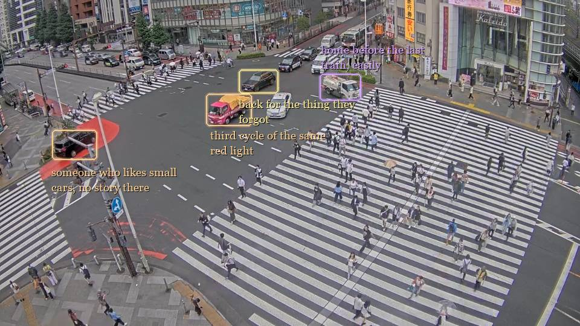

# passing stranger

*"Passing stranger! you do not know how longingly I look upon you, […]
I am to see to it that I do not lose you."*
— Walt Whitman, [To a Stranger](https://poets.org/poem/stranger)

A camera watches a street. For each car it sees, it makes up a driver — where
they're coming from, where they're going, what they're carrying. None of it is
real. The machine just over-reads: red car, eastbound, late afternoon → a
whole person, late for something.

Same car, same soul.

> every life invented · none of it is real

---

YOLO watches; word-lists and dice invent — no model, no key. The taste lives
in `style.py` and `correlator.py`. `python -m car_stories.server`, and the
tabs are live public feeds.
